# ArkaNetra MVP Explanation

Visual explanation of what has been built so far, how the current MVP works, and how the workflow moves from the current demo-hardened state toward the final full version.

Source of truth: `docs/DOC-001_Project_ArkaNetra_Constitution_v1.0.md`  
Current implementation baseline: Milestone 1.1 demo-hardened MVP  
Current data mode: synthetic proxy replay  
Current product mode: replay-first mission console  

## 1. What We Have Built So Far

ArkaNetra is currently a runnable MVP for a physics-informed, multimodal solar flare early-warning workflow. It is not yet an operational solar forecasting system. It is a working product skeleton that proves the end-to-end contract:

- Generate or ingest soft and hard X-ray-like time series.
- Compute physics-inspired features.
- Label short-horizon flare risk.
- Train baseline and multimodal-surrogate models.
- Produce flare probability, uncertainty, anomaly index, alert state, explanations, and replay scenarios.
- Serve those outputs through a Streamlit mission-console dashboard.
- Save evidence artifacts for judging and verification.

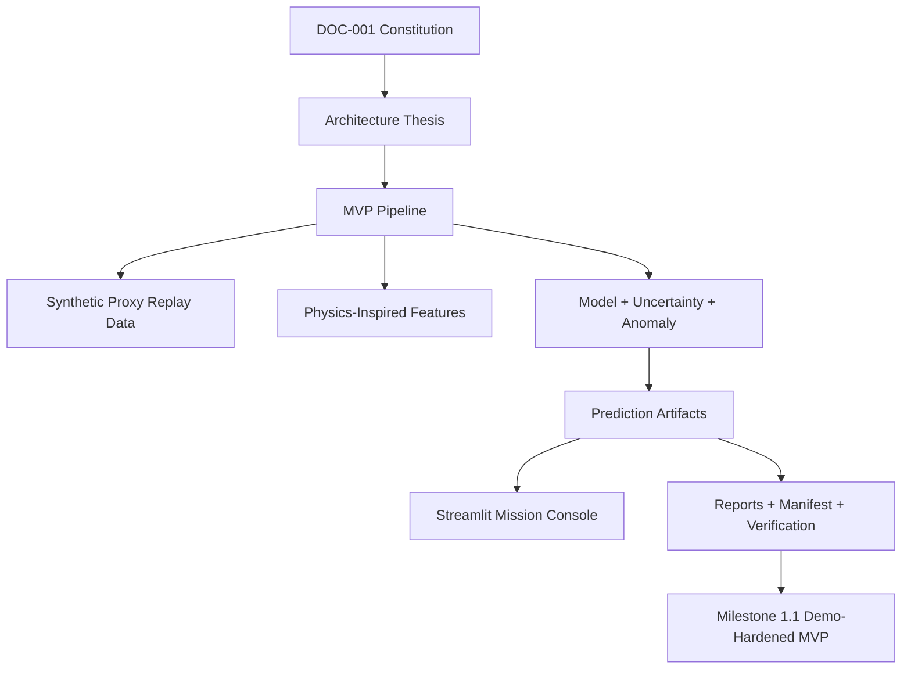

## 2. Current MVP Product View

The current MVP is designed to look and behave like a mission-control replay console. A judge or team member can select a replay scenario and inspect risk, uncertainty, anomaly behavior, feature drivers, attention snapshot, and model comparison.

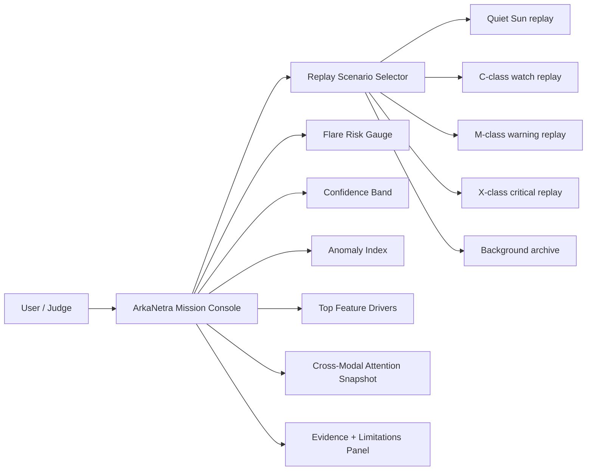

Current replay evidence:

| Scenario | State | Meaning |
| --- | --- | --- |
| Quiet Sun replay | NORMAL | Low probability and low anomaly, used to show non-alert behavior. |
| C-class watch replay | CRITICAL in current synthetic replay | Demonstrates event escalation and warning behavior. |
| M-class warning replay | CRITICAL | Demonstrates strong warning behavior. |
| X-class critical replay | CRITICAL | Demonstrates highest-risk replay state. |
| Background archive | QA-only | Contains non-curated rows and should not be used as the main judge demo. |

## 3. Repository And Artifact Structure

The repo is organized so the MVP can be rebuilt, verified, and explained from files instead of memory.

```mermaid
flowchart TD
    Root["Project Root"] --> App["app/streamlit_app.py"]
    Root --> Config["configs/mvp.yaml"]
    Root --> Src["src/arkanetra/"]
    Root --> Scripts["scripts/"]
    Root --> Data["data/processed/"]
    Root --> Reports["reports/"]
    Root --> Docs["docs/"]
    Root --> Tests["tests/"]

    Src --> Pipeline["pipeline.py"]
    Src --> Features["features.py"]
    Src --> Models["models.py"]
    Src --> Anomaly["anomaly.py"]
    Src --> DataModules["data/ adapters"]
    Src --> Torch["torch_models.py"]

    Scripts --> Build["build_mvp.py"]
    Scripts --> Verify["verify_mvp.py"]

    Reports --> Predictions["predictions/arkanetra_mvp_predictions.parquet"]
    Reports --> Metrics["metrics.csv"]
    Reports --> Events["event_summary.md"]
    Reports --> Manifest["artifact_manifest.json"]

    Docs --> Constitution["DOC-001 Constitution"]
    Docs --> Hardening["DOC-602 Milestone 1.1 Report"]
    Docs --> FullPlan["DOC-603 Full Implementation Plan"]
```

## 4. Data And Feature Workflow

The current MVP uses deterministic synthetic proxy replay data. This exists so the whole product can run immediately even before real GOES/RHESSI/Fermi data is integrated. The next milestone replaces at least one synthetic replay with a real GOES XRS event window.

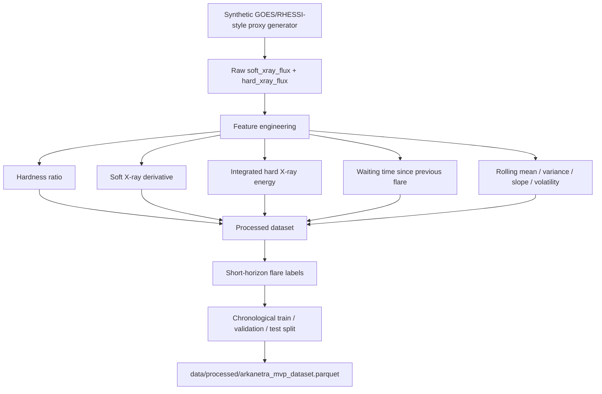

Important rule: features must be computed from past and current data only. Future data must not leak into model inputs.

## 5. Model And Prediction Workflow

The Constitution calls for a Dual-Branch Cross-Attention GRU. The current runnable MVP uses an executable sklearn/numpy multimodal fusion surrogate because the local runtime did not initially include PyTorch. A PyTorch model boundary already exists in `src/arkanetra/torch_models.py` for the next implementation phase.

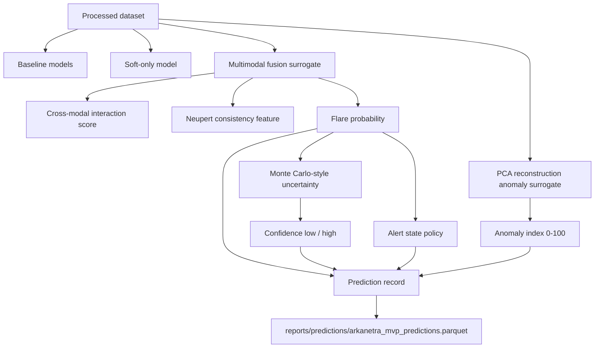

Current best generated demo model:

| Model | F1 | Precision | Recall | PR-AUC | ROC-AUC |
| --- | ---: | ---: | ---: | ---: | ---: |
| dual_branch_cross_attention_surrogate | 0.893 | 0.806 | 1.000 | 0.993 | 0.9997 |

## 6. Alert State Logic

The MVP converts model outputs into mission states using alert thresholds in `configs/mvp.yaml`.

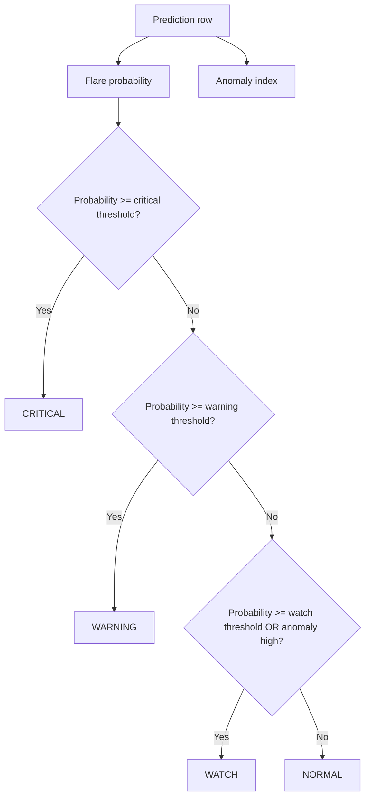

The current curated Quiet Sun replay stays NORMAL for all rows. That is important because the demo must show the system can avoid alerting under quiet conditions.

## 7. Dashboard Workflow

The dashboard does not train models live. It reads saved prediction artifacts. This makes the demo stable and reproducible.

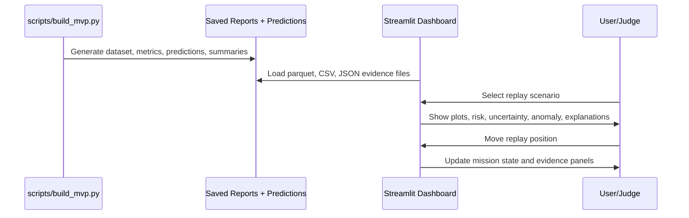

Dashboard panels currently include:

- Mission status header.
- Replay scenario selector.
- Soft X-ray plot.
- Hard X-ray and hardness plot.
- Flare risk gauge.
- Confidence band.
- Anomaly index.
- Top feature drivers.
- Cross-modal attention snapshot.
- Model comparison table.
- Replay scenario summary.
- Evidence and limitations expander.

## 8. Verification And Evidence Workflow

The MVP now has a simple verification loop.

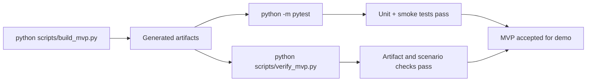

Current verification evidence:

- Test suite: `6 passed`.
- Verifier: `ArkaNetra MVP verification passed`.
- Dashboard: HTTP 200 on localhost port 8501.
- Prediction rows: 1728.
- Current scenarios: Quiet Sun, C-class, M-class, X-class, Background archive.

## 9. What Each Major Artifact Means

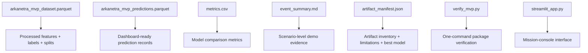

## 10. Phases Completed So Far

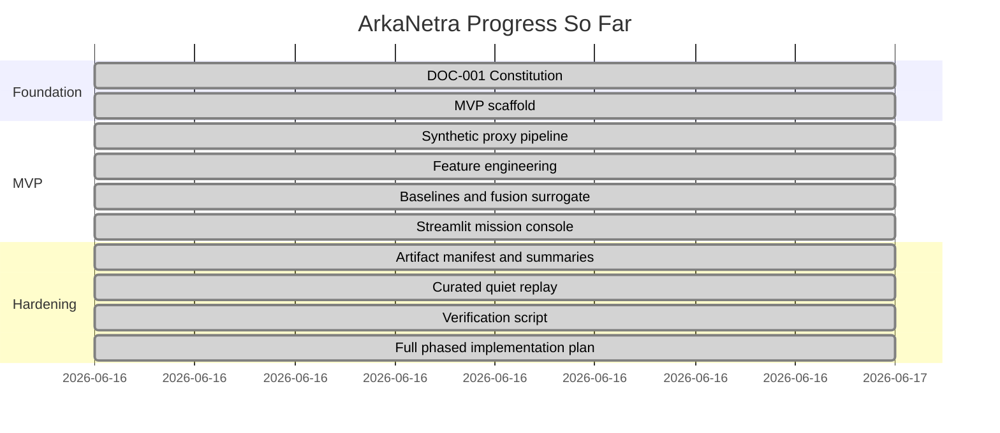

## 11. Current MVP To Final System Roadmap

The current MVP should evolve through these phases.

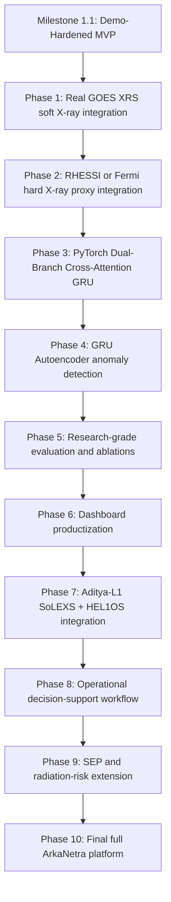

## 12. Future Full Architecture

This is the architecture ArkaNetra is moving toward, based on DOC-001.

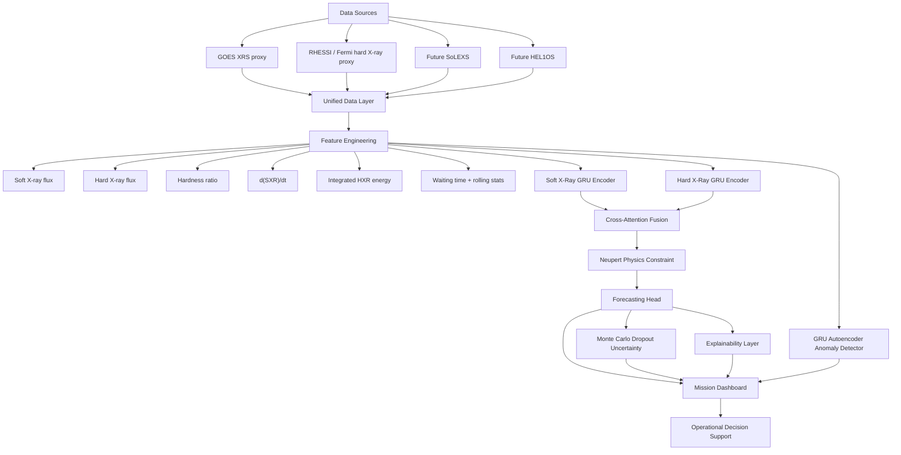

## 13. Why This Workflow Matters

ArkaNetra is built around an operational question, not just a machine-learning question.

Most simple systems answer:

- Will a flare occur?

ArkaNetra is designed to answer:

- Will a flare occur?
- How confident are we?
- Why does the system believe this?
- Is the Sun behaving unusually?
- What mission or radiation-risk context should analysts watch?

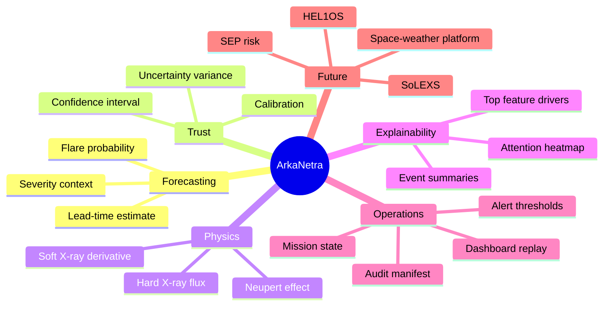

## 14. What To Do Next

The next implementation step is Phase 1 from DOC-603:

1. Define the real GOES XRS data source.
2. Add GOES ingestion mode while keeping synthetic mode.
3. Curate one real GOES flare replay.
4. Preserve the current dashboard and prediction contract.
5. Regenerate reports and run the verifier.

This keeps the product moving from demo-hardened MVP toward a scientifically credible real-data prototype without breaking the working system we already have.

